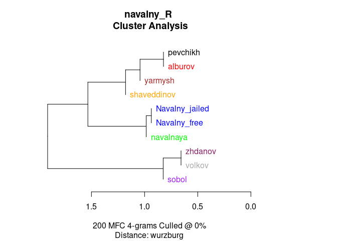
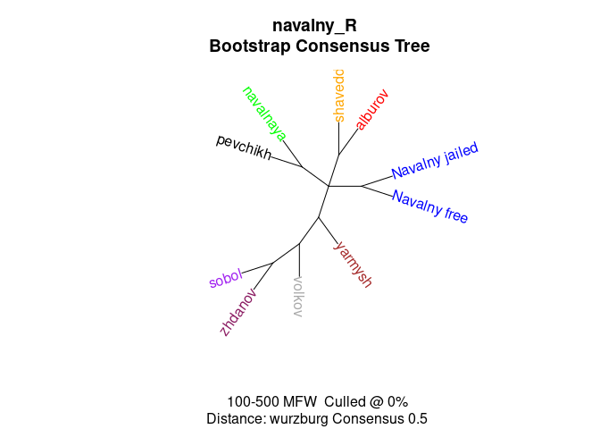
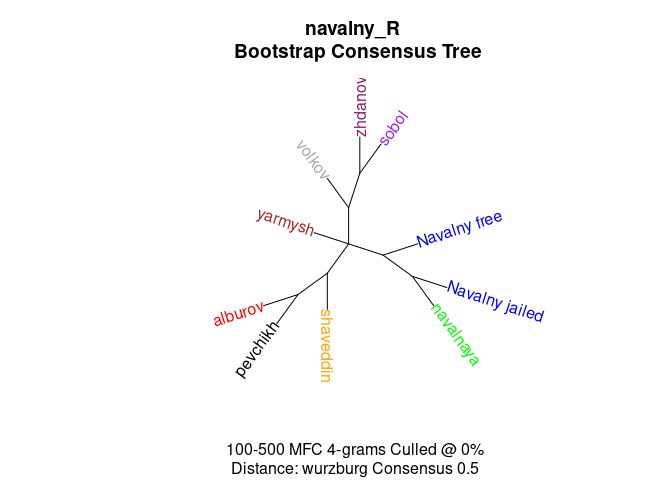
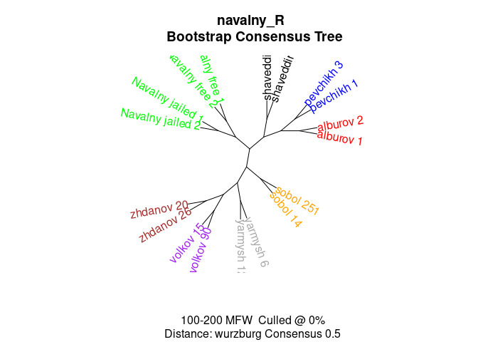
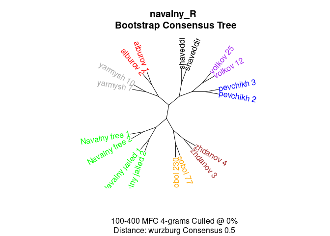
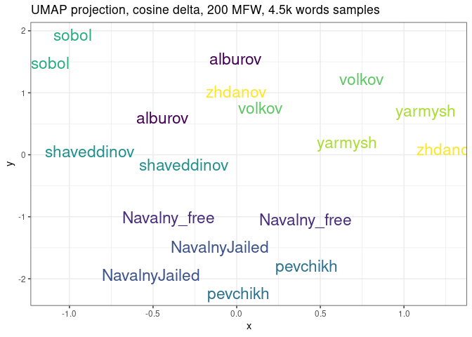
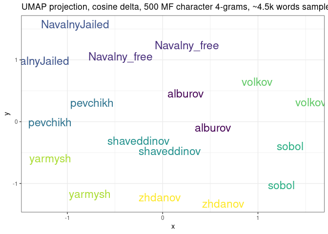
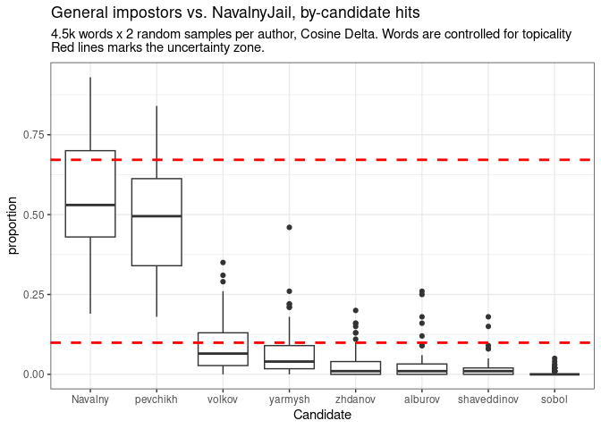

AA: Navalny
================
Artjoms Šeļa
2023-08-17

- <a href="#tldr-so-far" id="toc-tldr-so-far">tl;dr (so far)</a>
- <a href="#setup" id="toc-setup">Setup</a>
- <a href="#data-wrangling--book-keeping"
  id="toc-data-wrangling--book-keeping">Data wrangling &amp; book
  keeping</a>
  - <a href="#convenience-functions"
    id="toc-convenience-functions">Convenience functions</a>
- <a href="#exploratory-stylometry"
  id="toc-exploratory-stylometry">Exploratory stylometry</a>
  - <a href="#bootstrap-tree-words-all"
    id="toc-bootstrap-tree-words-all">Bootstrap tree, words, all</a>
  - <a href="#bootstrap-tree-chars-all"
    id="toc-bootstrap-tree-chars-all">Bootstrap tree, chars, all</a>
  - <a href="#bootstrap-tree-characters-true-samples"
    id="toc-bootstrap-tree-characters-true-samples">Bootstrap tree,
    characters, true samples</a>
- <a href="#features-to-clusters"
  id="toc-features-to-clusters">Features-to-clusters</a>
- <a href="#umap-projections" id="toc-umap-projections">UMAP
  projections</a>
  - <a href="#umap-global" id="toc-umap-global">UMAP global</a>
- <a href="#distribution-of-distances"
  id="toc-distribution-of-distances">Distribution of distances</a>
  - <a href="#character-n-grams" id="toc-character-n-grams">Character
    n-grams</a>
  - <a href="#words" id="toc-words">Words</a>
- <a href="#general-impostors" id="toc-general-impostors">General
  impostors</a>
  - <a href="#impostors-char-n-grams"
    id="toc-impostors-char-n-grams">Impostors: char n-grams</a>
  - <a href="#impostors-longer-samples"
    id="toc-impostors-longer-samples">Impostors: longer samples</a>

## tl;dr (so far)

////

So far, two strong candidates for “writings-from-jail” style emerged:
**1) Navalny himself** and **2) Maria Pevchikh**. Likely it’s a mixed
corpus.

////

1.  `Navalny_free` vs `Navalny_jail` samples show stable heterogeneity:
    there is similarity between them, but the difference is obvious,
    too.  
2.  When verified against potential candidates, `Navalny_jail` exhibits
    **mixed signal**, both `Navalny_free` and `Maria Pevchikh` show
    stylistic affinities with jail samples.  
3.  Overall, between-author relationships are muddied (e.g Zhdanov and
    Volkov show certain level of similarity), which can be a trace of
    editor/ghostwriter.  
4.  **Corpus needs more attention**: 1) I can’t rule out some systematic
    bias: what we might be seeing is a ‘platform signal’, not
    authorship. 2) More Y. Navalnaya’s samples, we see she is similar to
    Pevchikh and Navalny, but not enough data to do proper
    verification. 3) Something is off about Sobol samples that come from
    large telegram data (duplicates?).

## Setup

``` r
library(stylo)
library(tidyverse)
library(tidytext)
library(seetrees)
library(umap)
## the last one is the custom package for feature-to-cluster association
## run devtools::install_github("perechen/seetrees")
```

## Data wrangling & book keeping

Make one pool of words for each author

``` r
## read paths (remove intersecting Yarmysh_1 )
files <- list.files("corpus/",full.names = T)[-20]
names <- str_extract_all(files,"(?<=//).*?(?=_)") %>% unlist() %>% tolower() %>% unique()


for (a in names) {
  author <- files[str_detect(files,regex(a,ignore_case = T))]
  
  t <- lapply(author,read_file) %>%
  paste(collapse = "\n\n")
  
  if (!a %in% c("free", "jailed")) {
  write_file(t, paste0("corpus_clean/", a,".txt"))
  } else
  {write_file(t, paste0("corpus_clean/","Navalny_", a, ".txt"))}
  
  
}
```

This code processes a collection of text files from the "corpus_clean" directory. It extracts author names and tokenizes the text into words, excluding non-Cyrillic words and certain patterns. It then calculates and arranges the maximum token counts for each author.

``` r
# Load the necessary library for string manipulation
library(stringi)

# Get a list of file names in the "corpus_clean" directory
files = list.files("corpus_clean/", full.names = TRUE)

# Extract author names from the file paths using regular expressions and create a tibble
texts = tibble(
  path = files,
  author = str_extract_all(files, "(?<=//).*?(?=\\.txt)") %>% unlist(),
  text = lapply(files, read_lines)
)

# Tokenize the text in the corpus
corpus_tokenized = texts %>% 
  # Expand the tibble by separating text into individual lines
  unnest(cols = c(text)) %>% 
  # Group the data by author and assign a unique line number to each line
  group_by(author) %>% 
  mutate(line_id = row_number()) %>% 
  ungroup() %>% 
  # Tokenize each line into words
  unnest_tokens(input = text, output = word) %>% 
  # Check if the word contains Cyrillic characters
  mutate(is_cyrillics = stri_detect_regex(word, "\\p{Cyrillic}")) %>% 
  # Filter out non-Cyrillic words
  filter(is_cyrillics) %>% 
  # Remove certain patterns from words, such as URLs, colons, and periods
  mutate(word = str_remove_all(word, "https|\\:|\\."))

# Count the maximum number of tokens (words) for each author
author_token_counts = corpus_tokenized %>%
  group_by(author) %>%
  summarise(max_token_count = max(row_number())) %>%
  # Arrange the results in descending order of token count
  arrange(desc(max_token_count))
```

    ## # A tibble: 10 × 2
    ##    author               n
    ##    <chr>            <int>
    ##  1 sobol          1183927
    ##  2 volkov          434341
    ##  3 zhdanov         152178
    ##  4 yarmysh         100619
    ##  5 pevchikh         16046
    ##  6 alburov          12522
    ##  7 shaveddinov       9960
    ##  8 Navalny_jailed    9870
    ##  9 Navalny_free      9707
    ## 10 navalnaya         4892

This code processes the tokenized corpus, creating organized lines and paragraphs. It cleans and rewrites text to files. It also creates word chunks for character n-gram sampling and calculates author-specific line and token statistics.

``` r
# Group and summarize tokenized lines into full text lines for each document and author
corpus_lines <- corpus_tokenized %>% 
  group_by(path, author, line_id) %>% 
  summarize(line = paste(word, collapse = " "))

# Group and summarize lines into clean text for each document
corpus_clean <- corpus_lines %>% 
  group_by(path) %>% 
  summarize(text = paste(line, collapse = "\n\n"))

# Write the cleaned text back to their respective files
for (p in 1:nrow(corpus_clean)) {
  write_lines(corpus_clean$text[p], file = corpus_clean$path[p])
}

## To ensure more equal sequence lengths for character n-grams sampling
corpus_chunks <- corpus_tokenized %>%
  group_by(author) %>%
  mutate(word_id = row_number()) %>% 
  group_by(author, word_id) %>% 
  mutate(chunk = ceiling(word_id / 30)) %>% 
  group_by(author, chunk) %>% 
  summarize(line = paste(word, collapse = " "))

# Count the number of characters in each 'line' and summarize by author
corpus_lines %>% 
  mutate(nchar = lengths(str_extract_all(line, " "))) %>% 
  group_by(author) %>%
  summarise(n = max(row_number()), tokens = sum(nchar)) %>% 
  arrange(desc(n)) %>% 
  mutate(ratio = tokens / n)
```

    ## # A tibble: 10 × 4
    ##    author             n  tokens     r
    ##    <chr>          <int>   <int> <dbl>
    ##  1 sobol          20275 1163652  57.4
    ##  2 volkov          6795  427546  62.9
    ##  3 zhdanov         5576  146602  26.3
    ##  4 yarmysh         4137   96482  23.3
    ##  5 alburov          964   11558  12.0
    ##  6 pevchikh         519   15527  29.9
    ##  7 shaveddinov      482    9478  19.7
    ##  8 Navalny_free     474    9233  19.5
    ##  9 Navalny_jailed   358    9512  26.6
    ## 10 navalnaya        202    4690  23.2

### Convenience functions

Some convenience functions for later

``` r
# Define a function to sample text independently based on provided parameters
sample_independent_opt <- function(tokenized_df, n_samples, sample_size, text_var = "word", folder = "corpus_sampled/", overwrite = TRUE) {
  
  # Create the output folder if it doesn't exist
  dir.create(folder)
  
  # Remove existing files if overwrite is enabled
  if (overwrite) {
    do.call(file.remove, list(list.files(folder, full.names = TRUE)))
  }
  
  # Shuffle and sample from the tokenized data
  shuff <- tokenized_df %>%
    group_by(author) %>% 
    sample_n(n_samples * sample_size) %>% 
    mutate(sample = sample(rep(1:n_samples, each = sample_size))) %>% 
    unite(sample_id, c(author, sample), remove = FALSE) %>% 
    group_by(sample_id) %>%
    summarize(text = paste(!!sym(text_var), collapse = " "))
  
  # Write sampled text to files
  for (i in 1:nrow(shuff)) {
    write_file(file = paste0(folder, shuff$sample_id[i], ".txt"), shuff$text[i])
  }
}

# Define another function for different sampling approach
sample_independent <- function(tokenized_df, n_samples, sample_size, text_var = "word", folder = "corpus_sampled/", overwrite = TRUE) {
  
  # Create the output folder if it doesn't exist
  dir.create(folder)
  
  # Remove existing files if overwrite is enabled
  if (overwrite) {
    do.call(file.remove, list(list.files(folder, full.names = TRUE)))
  }
  
  # Shuffle rows for each author and enumerate samples
  shuff <- tokenized_df %>% 
    group_by(author) %>%
    do(sample_n(., size = nrow(.))) %>%  
    group_by(author) %>% 
    mutate(sample = ceiling(row_number() / sample_size)) %>%  
    unite(sample_id, c(author, sample), remove = FALSE) %>% 
    filter(sample != max(sample)) 
  
  # Seed samples and filter based on the seeds
  seed_s <- shuff %>%
    select(author, sample_id) %>%
    group_by(author) %>% 
    summarize(sample_id = unique(sample_id)) %>% 
    sample_n(n_samples)
  
  s <- shuff %>% 
    filter(sample_id %in% seed_s$sample_id) %>% 
    group_by(sample_id) %>%
    summarize(text = paste(!!sym(text_var), collapse = " "))
  
  # Write sampled text to files
  for (i in 1:nrow(s)) {
    write_file(file = paste0(folder, s$sample_id[i], ".txt"), s$text[i])
  }
}

# Define a function for text feature extraction using stylo
diy_stylo <- function(folder = "corpus_sampled/", mfw = 200, drop_words = TRUE, feature = "word", n_gram = 1) {
  
  # Load and parse tokenized texts
  tokenized.texts = load.corpus.and.parse(files = list.files(folder, full.names = TRUE), features = feature, ngram.size = n_gram)
  
  # Create a list of most frequent words (trimmed to top 2000 items)
  features = make.frequency.list(tokenized.texts, head = 5000)
  
  # Produce a table of relative frequencies
  data = make.table.of.frequencies(tokenized.texts, features, relative = TRUE)[, 1:mfw]
  
  # Identify strong content words
  s_words <- str_detect(colnames(data), paste(strong_words, collapse = "|"))
  
  if (drop_words) {
    data <- data[, !s_words]
  }
  
  # Modify row names
  rownames(data) <- str_remove_all(rownames(data), "^.*?//")
  rownames(data) <- str_replace_all(rownames(data), "Navalny_jail", "NavalnyJail")
  
  return(data)
}

# Uncomment and use the following lines for sampling and processing
# sample_independent(corpus_tokenized %>% filter(author != 'navalnaya'),
#                    sample_size = 4500,
#                    n_samples = 2)

# sample_independent(corpus_chunks %>% filter(author != 'navalnaya'),
#                    sample_size = 150,
#                    text_var = "line",
#                    n_samples = 2)
```

## Exploratory stylometry

The provided code initializes a stylo analysis with specific sets of settings.

``` r
# Set a specific seed for reproducibility
set.seed(1989)

# Perform a stylo analysis for Navalny samples
st_words <- stylo(
  gui = FALSE,                           # Run in non-GUI mode
  mfw.min = 200,                         # Minimum most frequent words count
  mfw.max = 200,                         # Maximum most frequent words count
  analyzed.features = "w",               # Analyze words
  ngram.size = 1,                        # Use unigrams (single words)
  distance.measure = "wurzburg",         # Use Würzburg distance measure
  sample.size = 4000,                    # Size of each sample
  number.of.samples = 2,                 # Number of samples to generate
  corpus.dir = "corpus_clean/",          # Directory containing the corpus files
  corpus.lang = "Other"                  # Language of the corpus
)
```

<!-- -->

``` r
# Set a specific seed for reproducibility
set.seed(1989)

# Perform a stylo analysis for Navalny samples with character n-grams
st_chars <- stylo(
  gui = FALSE,                           # Run in non-GUI mode
  mfw.min = 200,                         # Minimum most frequent words count
  mfw.max = 200,                         # Maximum most frequent words count
  analyzed.features = "c",               # Analyze character n-grams
  ngram.size = 4,                        # Use 4-grams (sequences of 4 characters)
  distance.measure = "wurzburg",         # Use Würzburg distance measure
  corpus.dir = "corpus_clean/",          # Directory containing the corpus files
  corpus.lang = "Other"                  # Language of the corpus
)
```

<!-- -->

``` r
## Perform true random sampling from the corpus
sample_independent(
  corpus_tokenized %>% filter(author != 'navalnaya'),  # Exclude specific author
  sample_size = 4500,                                   # Size of each sample
  text_var = "word",                                    # Analyze words
  n_samples = 2                                         # Number of samples to generate
)

## Perform a stylo analysis for true random samples with word features
st_word_true_samples <- stylo(
  gui = FALSE,                           # Run in non-GUI mode
  mfw.min = 200,                         # Minimum most frequent words count
  mfw.max = 200,                         # Maximum most frequent words count
  analyzed.features = "w",               # Analyze words
  ngram.size = 1,                        # Use unigrams (single words)
  distance.measure = "wurzburg",         # Use Würzburg distance measure
  corpus.dir = "corpus_sampled/",         # Directory containing the sampled corpus files
  number.of.samples = 2,                 # Number of samples to analyze
  corpus.lang = "Other"                  # Language of the corpus
)
```

<!-- -->

``` r
## Perform true random sampling from the corpus of text chunks (lines)
sample_independent(
  corpus_chunks %>% filter(author != 'navalnaya'),  # Exclude specific author
  sample_size = 160,                                # Size of each sample (lines)
  text_var = "line",                                # Analyze lines of text
  n_samples = 2                                     # Number of samples to generate
)

## Perform a stylo analysis for true random samples with character n-gram features
st_word_true_samples <- stylo(
  gui = FALSE,                           # Run in non-GUI mode
  mfw.min = 300,                         # Minimum most frequent words count
  mfw.max = 300,                         # Maximum most frequent words count
  analyzed.features = "c",               # Analyze character n-grams
  ngram.size = 4,                        # Use 4-grams (sequences of 4 characters)
  distance.measure = "wurzburg",         # Use Würzburg distance measure
  corpus.dir = "corpus_sampled/",         # Directory containing the sampled corpus files
  number.of.samples = 2,                 # Number of samples to analyze
  corpus.lang = "Other"                  # Language of the corpus
)
```

<!-- -->

### Bootstrap tree, words, all

``` r
bct_words <- stylo(gui=F,
            mfw.min=100,
            mfw.max=500,
            mfw.incr = 1,
            analyzed.features = "w",
            ngram.size = 1,
            analysis.type = "BCT",
            consensus.strength = 0.5,
            distance.measure = "wurzburg",
            corpus.dir="corpus_clean/",
            corpus.lang="Other")
```

<!-- -->

### Bootstrap tree, chars, all

``` r
# Perform a stylo analysis using Burrows' Delta with BCT method for word features
bct_words <- stylo(
  gui = FALSE,                           # Run in non-GUI mode
  mfw.min = 100,                         # Minimum most frequent words count
  mfw.max = 500,                         # Maximum most frequent words count
  mfw.incr = 1,                          # Incremental step for most frequent words count
  analyzed.features = "c",               # Analyze character n-grams
  ngram.size = 4,                        # Use 4-grams (sequences of 4 characters)
  analysis.type = "BCT",                 # Use Burrows' Delta with BCT method
  consensus.strength = 0.5,              # Set the consensus strength threshold
  distance.measure = "wurzburg",         # Use Würzburg distance measure
  corpus.dir = "corpus_clean/",          # Directory containing the corpus files
  sample.size = 4000,                    # Size of each sample
  number.of.samples = 2,                 # Number of samples to generate
  corpus.lang = "Other"                  # Language of the corpus
)
```

<!-- -->
\### Bootstrap tree, words, true samples

This code section first performs true random sampling from the tokenized corpus, creating two samples with 4500 words each while excluding a specific author.

``` r
## Perform true random sampling from the corpus
sample_independent(
  corpus_tokenized %>% filter(author != 'navalnaya'),  # Exclude specific author
  sample_size = 4500,                                   # Size of each sample
  text_var = "word",                                    # Analyze words
  n_samples = 2                                         # Number of samples to generate
)

## Perform a stylo analysis using BCT method for words
bct_words <- stylo(
  gui = FALSE,                           # Run in non-GUI mode
  mfw.min = 100,                         # Minimum most frequent words count
  mfw.max = 200,                         # Maximum most frequent words count
  mfw.incr = 1,                          # Incremental increase in most frequent words count
  analyzed.features = "w",               # Analyze words
  ngram.size = 1,                        # Use unigrams (single words)
  analysis.type = "BCT",                 # Use Burrows's Delta for Classification (BCT) method
  consensus.strength = 0.5,              # Set consensus strength for BCT analysis
  distance.measure = "wurzburg",         # Use Würzburg distance measure
  corpus.dir = "corpus_sampled/",         # Directory containing the sampled corpus files
  corpus.lang = "Other"                  # Language of the corpus
)
```

<!-- -->

### Bootstrap tree, characters, true samples

This code section first performs true random sampling from the chunked corpus, creating two samples with 150 lines each while excluding a specific author.

``` r
## Perform true random sampling from chunked corpus
sample_independent(
  corpus_chunks %>% filter(author != 'navalnaya'),  # Exclude specific author's chunks
  sample_size = 150,                                # Size of each sample
  text_var = "line",                                # Analyze lines
  n_samples = 2                                     # Number of samples to generate
)

## Perform a BCT stylo analysis on sampled chunks with character n-grams
bct_words <- stylo(
  gui = FALSE,                               # Run in non-GUI mode
  mfw.min = 100,                             # Minimum most frequent words count
  mfw.max = 400,                             # Maximum most frequent words count
  mfw.incr = 1,                              # Incremental step for MFW selection
  analyzed.features = "c",                   # Analyze character n-grams
  ngram.size = 4,                            # Use 4-grams (sequences of 4 characters)
  analysis.type = "BCT",                     # Perform BCT (Bootstrapped Class Typing) analysis
  consensus.strength = 0.5,                  # Set the consensus strength threshold
  distance.measure = "wurzburg",             # Use Würzburg distance measure
  corpus.dir = "corpus_sampled/",            # Directory containing the sampled corpus files
  corpus.lang = "Other"                      # Language of the corpus
)
```

<!-- -->

## Features-to-clusters

To check for overarching bias, genre or register signal, it is always
good idea to look at which features may drive overarching clustering.
Topic-related words like `камеру`, `приговор`, `договор`, `власти`,
`владимир`, `рф`, `войн(а)`, `путина`, `навальный`, `год`, `выборы`,
`поражение`, `соболь`, `шизо` could be candidates for excluding from
analysis.

``` r
# Perform a stylo analysis for word features
st_words <- stylo(
  gui = FALSE,                           # Run in non-GUI mode
  mfw.min = 200,                         # Minimum most frequent words count
  mfw.max = 200,                         # Maximum most frequent words count
  analyzed.features = "w",               # Analyze words
  ngram.size = 1,                        # Use unigrams (single words)
  distance.measure = "wurzburg",         # Use Würzburg distance measure
  corpus.dir = "corpus_clean/",          # Directory containing the clean corpus files
  corpus.lang = "Other",                 # Language of the corpus
  display.on.screen = FALSE             # Do not display output on the screen
)

# View the dendrogram tree
view_tree(
  st_words,                            # Dendrogram data
  k = 2,                               # Number of clusters
  right_margin = 10,                   # Set the right margin for the plot
  p = 0.05                              # Control the width of labels
)
```

<!-- --><!-- -->

``` r
strong_words <- c("^украин", "^росси", "^навальн", "^войн", "^мир", "^против$", "^челов", "^путин", "^рф$", "^cоболь", "^выбор", "^власт", "^алексе", "^расследова", "^шизо", "^видео")
```

## UMAP projections

UMAP (Uniform Manifold Approximation and Projection) is a data visualization technique. It's used for reducing the dimensionality of high-dimensional data, such as word frequency data in text analysis. UMAP maintains data structure while simplifying it, aiding visualization and analysis.

On words:

``` r
# Perform independent sampling from the tokenized corpus
sample_independent(
  tokenized_df = corpus_tokenized %>% filter(author != "navalnaya"),  # Exclude specific author
  sample_size = 4500,                                                 # Size of each sample
  n_samples = 2,                                                      # Number of samples to generate
  text_var = "word",                                                  # Analyze words
  overwrite = TRUE,                                                   # Overwrite existing files
  folder = "corpus_sampled/"                                           # Output folder for samples
)

# Perform DIY stylo analysis on the sampled corpus
dt <- diy_stylo("corpus_sampled/", mfw = 200, drop_words = TRUE)

# Perform UMAP projection on the analysis results
projection <- umap(dt, data = "dist")

# Create a tibble for plotting UMAP results
umap_plot_data <- tibble(
  x = projection$layout[, 1],
  y = projection$layout[, 2],
  author = str_remove_all(rownames(dt), "_[0-9]*?$")
)

# Create a scatter plot with UMAP projection results
ggplot(umap_plot_data, aes(x, y, color = author)) + 
  geom_text(aes(label = author), size = 6) + 
  theme_bw() + 
  guides(color = "none") + 
  scale_color_viridis_d() + 
  labs(title = "UMAP projection, cosine delta, 200 MFW, 4.5k words samples")
```

<!-- -->

On char 4-grams:

``` r
# Perform independent sampling of chunks from the corpus, excluding a specific author
sample_independent(
  tokenized_df = corpus_chunks %>% filter(author != "navalnaya"),  # Exclude a specific author
  sample_size = 160,                                               # Size of each sample
  n_samples = 2,                                                   # Number of samples to generate
  text_var = "line",                                               # Analyze lines
  overwrite = TRUE,                                                # Overwrite existing files
  folder = "corpus_sampled/"                                       # Output folder for samples
)

# Extract character-level features and perform UMAP projection
dt <- diy_stylo("corpus_sampled/", mfw = 200, drop_words = TRUE, feature = "c", n_gram = 4)

# Perform UMAP projection on the feature data
projection <- umap(dt, data = "dist")

# Create a tibble for visualization
visualization_data <- tibble(
  x = projection$layout[, 1],
  y = projection$layout[, 2],
  author = str_remove_all(rownames(dt), "_[0-9]*?$")
)

# Create a scatter plot using ggplot
ggplot(visualization_data, aes(x, y, color = author)) + 
  geom_text(aes(label = author), size = 6) + 
  theme_bw() + 
  guides(color = "none") + 
  scale_color_viridis_d() + 
  labs(title = "UMAP projection, cosine delta, 200 MF character 4-grams, ~4.5k words samples")
```

<!-- -->

``` r
# Perform independent sampling of chunked text
sample_independent(
  tokenized_df = corpus_chunks %>% filter(author != "navalnaya"),  # Exclude specific author
  sample_size = 160,                                              # Size of each sample
  n_samples = 2,                                                  # Number of samples to generate
  text_var = "line",                                              # Analyze lines
  overwrite = TRUE,                                               # Overwrite existing files
  folder = "corpus_sampled/"                                      # Output folder
)

# Extract features and perform DIY stylo analysis
dt <- diy_stylo("corpus_sampled/", mfw = 500, drop_words = TRUE, feature = "c", n_gram = 4)

# Perform UMAP projection on the analysis data
projection <- umap(dt, data = "dist")

# Create a tibble for visualization
tibble(
  x = projection$layout[, 1],
  y = projection$layout[, 2],
  author = str_remove_all(rownames(dt), "_[0-9]*?$")
) %>%
  ggplot(aes(x, y, color = author)) +
  geom_text(aes(label = author), size = 6) +
  theme_bw() +
  guides(color = "none") +
  scale_color_viridis_d() +
  labs(title = "UMAP projection, cosine delta, 500 MF character 4-grams, ~4.5k words samples")
```

<!-- -->

### UMAP global

More samples for each author (if available)

This code section reshuffles rows within author groups in the tokenized corpus, generates seed samples for analysis, and prepares the sampled documents for analysis.

``` r
# Reshuffle rows within each author group in the tokenized corpus
shuff <- corpus_tokenized %>% 
  group_by(author) %>%
  do(sample_n(., size = nrow(.))) %>%  # Perform row shuffling
  group_by(author) %>% 
  mutate(sample = ceiling(row_number() / 4500)) %>%  # Enumerate and group into samples
  unite(sample_id, c(author, sample), remove = FALSE) #%>% 
#  filter(sample != max(sample)) # Discard the last (shorter) sample

## Generate seed samples for analysis
seed_s <- shuff %>%
  select(author, sample_id) %>%
  group_by(author) %>% 
  summarize(sample_id = unique(sample_id)) %>% 
  mutate(n = row_number(),
         is_large = ifelse(max(n) > 20, TRUE, FALSE))  %>% 
  group_by(is_large) %>% 
  group_split(is_large)

# Sample 20 documents from the very large corpora to make analysis reasonable
seed_s[[2]] <- seed_s[[2]] %>% group_by(author) %>% sample_n(20)

# Combine the sampled seed documents
seed_s <- bind_rows(seed_s)

# Filter and collect documents based on the sampled seed IDs
s <- shuff %>% 
  filter(sample_id %in% seed_s$sample_id) %>% 
  group_by(sample_id) %>%
  summarize(text = paste(word, collapse = " "))

# Remove existing files in the output directory
do.call(file.remove, list(list.files("corpus_sampled/", full.names = TRUE)))
```

    ##  [1] TRUE TRUE TRUE TRUE TRUE TRUE TRUE TRUE TRUE TRUE TRUE TRUE TRUE TRUE TRUE
    ## [16] TRUE TRUE TRUE

``` r
# Write the sampled text to files in the "corpus_sampled/" directory
for (i in 1:nrow(s)) {
  write_file(file = paste0("corpus_sampled/", s$sample_id[i], ".txt"), s$text[i])
}

# Perform text feature extraction using stylo on the sampled corpus
dt <- diy_stylo("corpus_sampled/", mfw = 200, drop_words = TRUE)

# Perform UMAP projection on the extracted features
projection <- umap(dt, data = "dist")

# Create a tibble with UMAP projection coordinates and author names
umap_tibble <- tibble(
  x = projection$layout[, 1],
  y = projection$layout[, 2],
  author = str_remove_all(rownames(dt), "_[0-9]*?$")
) %>%
  # Exclude specific author from the plot
  filter(author != "sobol") %>% 
  # Create a scatter plot
  ggplot(aes(x, y, color = author)) + 
  geom_text(aes(label = author), size = 5) +  # Add author labels
  theme_bw() +                                 # Apply a black-and-white theme
  guides(color = "none") +                     # Hide the color legend
  scale_color_viridis_d() +                    # Apply a color scale
  labs(title = "UMAP projection, cosine delta, 200 MF words, 4.5k words samples")  # Set plot title
```

<!-- -->

I filtered out Sobol previously because something is really off about
her corpus.

## Distribution of distances

Let’s set up a small ‘bootstrap the distance’ experiment to see how
differences between (and within) authors are distributed. In spirit this
is similar to ‘general imposters’ verification, but just relying on a
distance distribution instead of nearest-neighbor classification.

For I iterations:  
1. Pick MFW cutoff randomly;  
2. Take random samples and calculate distances;  
3. Record distances for each pair of relationships.

### Character n-grams

``` r
# Define a function to process the distance table from stylo results
process_distances <- function(stylo_res) {
  # Convert stylo results to a matrix
  dt <- stylo_res %>% as.matrix()
  
  # Convert the matrix to a long-format tibble
  d_long <- dt %>% 
    as_tibble() %>%                  # Convert to tibble
    mutate(source = colnames(dt)) %>%   # Add source column based on column names
    pivot_longer(1:nrow(dt), names_to = "target", values_to = "distance") %>%  # Convert to long format
    mutate(source = str_remove(source, "_[0-9]*$"),    # Remove appended index from source
           target = str_remove(target, "_[0-9]*$")) %>%  # Remove appended index from target
    filter(distance != 0)          # Exclude distances with value 0
    
  return(d_long)
}

# Define a function to plot distance distributions
plot_distances <- function(df) {
  df %>% 
    ggplot(aes(distance, fill = mean)) +               # Create a ggplot with distance and mean fill
    geom_density(alpha = 0.6) +                        # Add density plot
    geom_vline(aes(xintercept = mean)) +               # Add vertical line for mean
    facet_grid(source ~ target, scales = "free_y") +   # Facet grid for sources and targets
    theme_bw() +                                       # Use black-and-white theme
    scale_fill_gradient2(                              # Color gradient for fill
      high = lannister[1],                             # High color
      mid = lannister[3],                              # Mid color
      low = lannister[5],                              # Low color
      midpoint = 1.05                                  # Midpoint for gradient
    )
}
```

``` r
# Number of iterations for the experiment
iters = 1000

# Minimum and maximum number of features (most frequent words)
min_features = 50
max_features = 500

# Create an empty list to store distance results
d_res <- vector(mode = "list", length = iters)

# Loop through iterations
for (i in 1:iters) {
  # Randomly select a value for most frequent words count within the specified range
  mfw <- sample(seq(min_features, max_features, by = 10), 1)
  
  # Perform true random sampling on the corpus chunks while excluding a specific author
  sample_independent_opt(
    corpus_chunks %>% filter(author != 'navalnaya'),  # Exclude specific author
    sample_size = 150,                                # Size of each sample
    text_var = "line",                                # Analyze lines
    n_samples = 2                                     # Number of samples to generate
  )
  
  # Perform a stylo analysis for character n-grams on the sampled corpus
  st_res <- stylo(
    gui = FALSE,                           # Run in non-GUI mode
    mfw.min = mfw,                         # Minimum most frequent words count
    mfw.max = mfw,                         # Maximum most frequent words count
    analyzed.features = "c",               # Analyze character n-grams
    ngram.size = 4,                        # Use 4-grams (sequences of 4 characters)
    distance.measure = "wurzburg",         # Use Würzburg distance measure
    corpus.dir = "corpus_sampled/",         # Directory containing the sampled corpus files
    corpus.lang = "Other",                 # Language of the corpus
    display.on.screen = FALSE              # Do not display on screen
  )
  
  # Process and extract distances from the stylo result
  d_long <- process_distances(st_res$distance.table)
  
  # Assign the results to the list
  d_res[[i]] <- d_long
}

# Save the distance results list to a file
saveRDS(d_res, file = "d_res.rds")
```

``` r
# Load distance results from an RDS file
d_res <- readRDS("d_res.rds")

# Define color palette
lannister = c("#5C0000", "#890000", "#C50000", "#FB7E00", "#FFA700")

# Combine and preprocess distance data
d_df <- d_res %>%
  bind_rows() %>% 
  group_by(source, target) %>% 
  # Remove numeric suffixes from target and source
  mutate(target = str_remove(target, "_[0-9]*?$"),
         source = str_remove(source, "_[0-9]*?$")) %>%
  # Calculate mean distance for each source-target pair
  mutate(mean = mean(distance)) 

# Extract mean distance value for 'Navalny_jailed' to 'Navalny_jailed'
navjail_mean <- d_df %>% 
  filter(source == "Navalny_jailed", target == "Navalny_jailed") %>% 
  pull(mean) %>% 
  unique()

# Plot distance distributions and add annotations
d_df %>% 
  plot_distances() +  # Plot distance distributions
  labs(
    title = "Between sample distance distributions",
    subtitle = "Character 4-grams, 50 to 500 MFW, 4.5k x 2 random samples per author, 1000 iterations"
  ) +
  theme(strip.text = element_text(size = 10)) +  # Adjust strip text size
  # Add a vertical line for 'Navalny_jailed' mean distance
  geom_vline(
    data = . %>% filter(target == "Navalny_jailed"),
    aes(xintercept = navjail_mean),
    color = "red",
    linewidth = 1
  )
```

<!-- -->

``` r
ggsave("inoutdistances.png",width = 10,height = 7)
```

### Words

Same, but for words (with the removal of ‘strong topical words’)

``` r
# Set the number of iterations, minimum features, and maximum features
iters = 500
min_features = 50
max_features = 200 

# Initialize an empty list to store results
d_res_w <- vector(mode = "list", length = iters)

# Iterate over the specified number of iterations
for (i in 1:iters) {
  # Randomly select a most frequent word count (between min and max features)
  mfw <- sample(seq(min_features, max_features, by = 10), 1)
  
  # Perform optimized independent sampling
  sample_independent_opt(
    corpus_tokenized %>% filter(author != 'navalnaya'),  # Exclude specific author
    sample_size = 4500,                                 # Size of each sample
    text_var = "word",                                  # Analyze words
    n_samples = 2                                       # Number of samples to generate
  )
  
  # Load and parse tokenized texts from the specified directory
  tokenized.texts = load.corpus.and.parse(
    files = list.files("corpus_sampled/", full.names = TRUE)
  )

  # Compute most frequent words list and relative frequencies table
  features = make.frequency.list(tokenized.texts, head = 5000)
  data = make.table.of.frequencies(tokenized.texts, features, relative = TRUE)[, 1:mfw]
  
  # Identify and remove strong content words
  s_words <- str_detect(colnames(data), paste(strong_words, collapse = "|"))
  data <- data[, !s_words]

  # Modify row names
  rownames(data) <- str_remove_all(rownames(data), "^.*?//")
  
  # Compute distance matrix using Würzburg distance and process distances
  dt <- dist.wurzburg(data) %>%  as.dist(upper = TRUE, diag = TRUE)
  d_long <- process_distances(dt)
  
  # Assign the results to the list
  d_res_w[[i]] <- d_long
}

# Save the result list as an RDS file
saveRDS(d_res_w, file = "d_res_w.rds")
```

``` r
# Load a saved RDS file containing distance results
d_res_w <- readRDS("d_res_w.rds")

# Combine results into a single dataframe and calculate mean distances
d_df <- d_res_w %>%
  bind_rows() %>% 
  group_by(source, target) %>% 
  mutate(mean = mean(distance))

# Calculate mean distance for "Navalny_jailed" samples
navjail_mean <- d_df %>% 
  filter(source == "Navalny_jailed", target == "Navalny_jailed") %>% 
  pull(mean) %>% 
  unique()

# Calculate mean distance for "Navalny_free" samples
navfree_mean <- d_df %>% 
  filter(source == "Navalny_free", target == "Navalny_free") %>% 
  pull(mean) %>% 
  unique()

# Create a distance plot with specific annotations and formatting
d_df %>% 
  plot_distances() +
  labs(title = "Between sample distance distributions", 
       subtitle = "Word frequencies, 50 to 200 MFW, 4.5k words x 2 random samples per author, 1000 iterations") +
  theme(strip.text = element_text(size = 10)) +
  geom_vline(data = . %>% filter(target == "Navalny_jailed"), 
             aes(xintercept = navjail_mean), color = "red", linewidth = 1) +
  geom_vline(data = . %>% filter(target == "Navalny_free"), 
             aes(xintercept = navfree_mean), color = "red", linewidth = 1)
```

<!-- -->
Pevchikh signal is visibly strong for Navalny-in-jail (but not the free
corpus).

## General impostors

Let’s run general impostors method on larger samples and words
frequencies. We also will remove words that influence overarching
clustering.

The goal of the method is determine the *affinity* of a target sample
(in our case - Navalny in jail) to a set of candidates/impostors.
Imposters are there to provide a stylistic alternative bucket to a
candidate (in our case - free Navalny). Method records the proportion of
times target text fit to each candidate class (nearest-neighbor method).

First, let’s try to determine the ‘confidence scope’ for a given corpus
(not incluidng Jailed N here). Values between which lies the uncertain
‘i don’t know’ zone.

``` r
# Create an empty list to store optimization results
op_list_w <- vector("list", 20)

# Perform optimization for 20 iterations
for (i in 1:20) {
  
  # Perform optimized independent sampling from the corpus
  sample_independent_opt(
    corpus_tokenized %>% filter(author != 'navalnaya'),  # Exclude a specific author
    sample_size = 4500,                                   # Size of each sample
    text_var = "word",                                    # Analyze words
    n_samples = 2                                         # Number of samples to generate
  )
  
  # Extract data from the sampled corpus for stylo analysis
  data <- diy_stylo(
    folder = "corpus_sampled/",
    mfw = 200,             # Maximum most frequent words count
    feature = "w",         # Analyze words
    n_gram = 1,            # Use unigrams (single words)
    drop_words = TRUE      # Exclude certain words
  )
  
  # Optimize imposters analysis and store the result
  op_list_w[[i]] <- imposters.optimize(data[-c(5, 6),])
}

# Save the list of optimization results to a file
saveRDS(op_list_w, "op_list_w.rds")
```

``` r
op_list_w <- readRDS("op_list_w.rds")

min_mean_w <- map(op_list_w, 1) %>% unlist() %>% mean()
max_mean_w <- map(op_list_w, 2) %>% unlist() %>% mean()
```

Values range from \~0.1 to \~0.67, which is a wide uncertainty zone.
Indicate some problems with authorial distinction.

``` r
# Initialize a list to store important results
imp_res <- vector("list", length = 100)
c = 0  # Counter for storing results

# Loop through iterations
for (i in 1:50) {
  
  # Perform optimized independent random sampling from the corpus
  sample_independent_opt(
    corpus_tokenized %>% filter(author != 'navalnaya'),  # Exclude specific author
    sample_size = 4500,                                   # Size of each sample
    text_var = "word",                                    # Analyze words
    n_samples = 2                                         # Number of samples to generate
  )
  
  # Extract important features for analysis
  data <- diy_stylo(
    folder = "corpus_sampled/",
    mfw = 200,        # Most frequent words count
    feature = "w",    # Analyze words
    n_gram = 1,       # Use unigrams (single words)
    drop_words = TRUE # Drop certain words
  )
  
  # Loop through selected candidates
  for (s in c(5, 6)) {
    
    # Perform imposters analysis
    r <- imposters(
      reference.set = data[-c(5:6),],  # Reference data without specific candidates
      test = data[c(s),],              # Test data with specific candidate
      features = 0.5,                  # Percentage of features to consider
      iterations = 100,                # Number of iterations
      distance = "wurzburg"           # Distance measure
    )
    
    c = c + 1  # Increment the counter
    imp_res[[c]] <- tibble(candidate = names(r), proportion = r)  # Store results
    
  }
}

# Save the results as an RDS file
saveRDS(imp_res, "imp_res.rds")
```

``` r
imp_res <- readRDS("imp_res.rds")
imp_res %>% bind_rows() %>% ggplot(aes(reorder(candidate,-proportion),proportion))  + geom_boxplot() + theme_bw() + 
  geom_hline(aes(yintercept=min_mean_w),linewidth=1,linetype=2,color="red") +
    geom_hline(aes(yintercept=max_mean_w),linewidth=1,linetype=2,color="red") +
  labs(x="Candidate", title="General impostors vs. NavalnyJail, by-candidate hits", subtitle="4.5k words x 2 random samples per author, Cosine Delta. Words are controlled for topicality\nRed lines marks the uncertainty zone.")
```

<!-- -->

Pevchikh signal remains strong, both Navalny attribution and Pevchikh
attribution remain in uncertainty zone (determined from <c@1> score).

### Impostors: char n-grams

``` r
# Initialize an empty list to store optimization results
op_list <- vector("list", 20)

# Perform optimization loop 20 times
for (i in 1:20) {
  
  # Perform optimized independent sampling on chunks of text, excluding a specific author
  sample_independent_opt(
    corpus_chunks %>% filter(author != 'navalnaya'),  # Exclude specific author
    sample_size = 160,                                 # Size of each sample
    text_var = "line",                                 # Analyze lines
    n_samples = 2                                      # Number of samples to generate
  )
  
  # Extract features and perform DIY stylometry analysis
  data <- diy_stylo(
    folder = "corpus_sampled/",
    mfw = 500,
    feature = "c",                                     # Analyze character n-grams
    n_gram = 4,                                        # Use 4-grams (sequences of 4 characters)
    drop_words = FALSE                                 # Keep words in the analysis
  )
  
  # Perform imposters.optimize on the data
  op_list[[i]] <- imposters.optimize(data[-c(5, 6),])  # Exclude specific rows from data
  
}

# Save the optimization results to an RDS file
saveRDS(op_list, "op_list.rds")
```

``` r
op_list <- readRDS("op_list.rds")

min_mean <- map(op_list, 1) %>% unlist() %>% mean()
max_mean <- map(op_list, 2) %>% unlist() %>% mean()
```

``` r
# Create an empty list to store the results
imp_res_char <- vector("list", length = 100)

# Initialize a counter for the iterations
c = 0

# Iterate for 50 rounds
for (i in 1:50) {
  
  # Perform independent random sampling of line chunks, excluding a specific author
  sample_independent(
    corpus_chunks %>% filter(author != 'navalnaya'),  # Exclude specific author
    sample_size = 160,                                # Size of each sample
    text_var = "line",                                # Analyze lines
    n_samples = 2                                     # Number of samples to generate
  )
  
  # Extract character n-gram features and perform a DIY stylo analysis
  data <- diy_stylo(
    folder = "corpus_sampled/",  # Directory containing the sampled corpus files
    mfw = 500,                  # Most frequent words count
    feature = "c",              # Analyze character n-grams
    n_gram = 4,                 # Use 4-grams (sequences of 4 characters)
    drop_words = FALSE          # Do not drop words
  )
  
  # Iterate for specific samples
  for (s in c(5, 6)) {
    
    # Calculate imposters using DIY stylo's 'imposters' function
    r <- imposters(
      reference.set = data[-c(5:6), ],   # Exclude specific rows from the reference set
      test = data[c(s), ],               # Select a specific row for testing
      features = 0.5,                    # Use 50% of features for imposters calculation
      iterations = 100,                  # Number of iterations
      distance = "wurzburg"              # Use Würzburg distance measure
    )
    
    # Increment the counter
    c = c + 1
    
    # Store the imposter results in the list
    imp_res_char[[c]] <- tibble(candidate = names(r), proportion = r)
  }
}

# Save the imposter results to a file
saveRDS(imp_res_char, "imp_res_char.rds")
```

``` r
imp_res_char <- readRDS("imp_res_char.rds")

imp_res_char %>% bind_rows() %>% ggplot(aes(reorder(candidate,-proportion),proportion))  + geom_boxplot() + theme_bw() + geom_hline(aes(yintercept=max_mean),linewidth=1,color="red",linetype=2) +
  geom_hline(aes(yintercept=min_mean),linewidth=1,color="red",linetype=2) +labs(x="Candidate", title="General impostors vs. NavalnyJail, by-candidate hits", subtitle="5k 4-char ngrams x 2 random samples per author, Cosine Delta, 500 MFW \nRed lines marks the uncertainty zone")
```

<!-- -->
Char n-grams better capture `Navalny_jail` as Navalny, but Pevchikh,
again, is uncharacteristically high (cannot reject her). Volkov and
Zhdanov interfere more with the signal, which might be because of
topical signal (n-grams are not filtered for “too distinctive”
non-stylistic features), or even a ‘platform’ signal.

### Impostors: longer samples

``` r
# Create an empty list to store the important results
imp_res_lg <- vector("list", length = 50)

# Loop through a certain number of iterations
for (i in 1:100) {

  # Perform optimized independent sampling from the corpus excluding specific author
  sample_independent_opt(
    corpus_tokenized %>% filter(author != 'navalnaya'),  # Exclude specific author
    sample_size = 9000,                                  # Size of each sample
    text_var = "word",                                   # Analyze words
    n_samples = 1                                         # Number of samples to generate
  )
  
  # Extract and process features from the sampled corpus
  data <- diy_stylo(folder = "corpus_sampled/", mfw = 200, drop_words = TRUE)
  
  # Compute imposters using the processed data
  r <- imposters(
    reference.set = data[-c(3),],    # Reference set for imposters
    test = data[c(3),],              # Test case for imposters
    features = 0.5,                  # Fraction of features to be used
    iterations = 100,                # Number of iterations for imposters calculation
    distance = "wurzburg"            # Distance measure to use
  )
  
  # Store imposters results in the list
  imp_res_lg[[i]] <- tibble(candidate = names(r), proportion = r)
}

# Save the list of important results to a file
saveRDS(imp_res_lg, "imp_res_lg.rds")
```

``` r
imp_res_lg <- readRDS("imp_res_lg.rds")

imp_res_lg %>% bind_rows() %>% ggplot(aes(reorder(candidate,-proportion),proportion))  + geom_boxplot() + theme_bw() + geom_hline(aes(yintercept=min_mean_w),linewidth=1,color="red",linetype=2) + 
  geom_hline(aes(yintercept=max_mean_w),linewidth=1,color="red",linetype=2) + 
  labs(x="Candidate", title="General impostors vs. NavalnyJail, by-candidate hits", subtitle="9k words equal sample per author, Cosine Delta, 200 MFW \nRed lines marks the uncertainty zone")
```

<!-- -->
