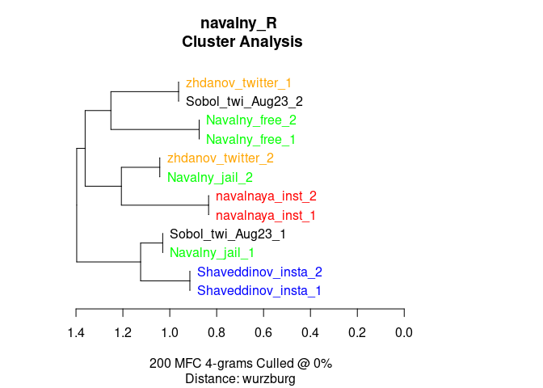
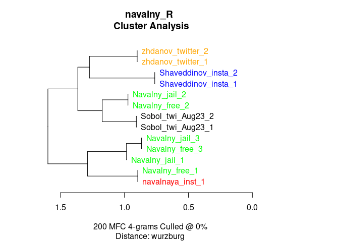
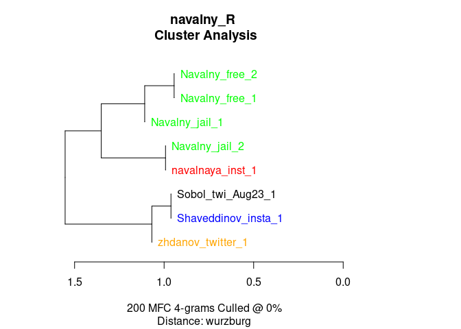
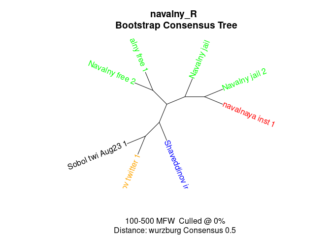
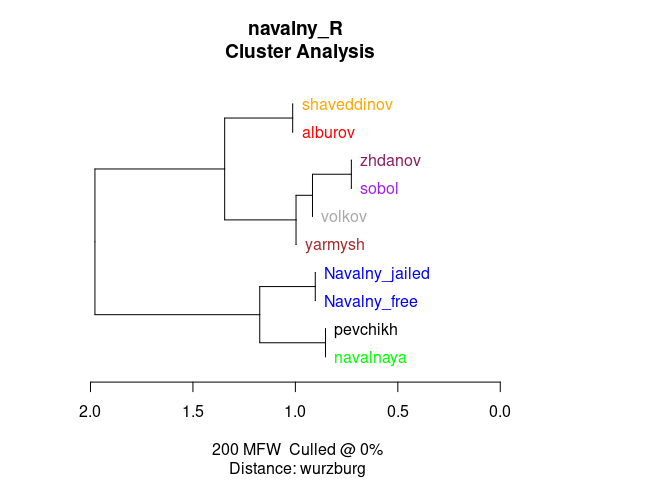
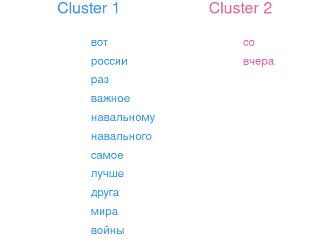

AA: Navalny
================
Artjoms Šeļa
2023-08-17

- <a href="#setup" id="toc-setup">Setup</a>
- <a href="#data-wrangling--book-keeping"
  id="toc-data-wrangling--book-keeping">Data wrangling &amp; book
  keeping</a>
- <a href="#exploratory-stylometry"
  id="toc-exploratory-stylometry">Exploratory stylometry</a>
  - <a href="#bootstrap-tree-words-chunks"
    id="toc-bootstrap-tree-words-chunks">Bootstrap tree, words, chunks</a>
  - <a href="#bootstrap-tree-characters-chunks"
    id="toc-bootstrap-tree-characters-chunks">Bootstrap tree, characters,
    chunks</a>
- <a href="#features-to-clusters"
  id="toc-features-to-clusters">Features-to-clusters</a>
- <a href="#distribution-of-distances"
  id="toc-distribution-of-distances">Distribution of distances</a>
  - <a href="#character-n-grams" id="toc-character-n-grams">Character
    n-grams</a>
  - <a href="#words" id="toc-words">Words</a>
- <a href="#tldr-so-far" id="toc-tldr-so-far">tl;dr (so far)</a>

## Setup

``` r
library(stylo)
library(tidyverse)
library(seetrees)
library(progress)
## the last one is the custom package for feature-to-cluster association
## run devtools::install_github("perechen/seetrees")
```

## Data wrangling & book keeping

1.  Make one document for Navalny-jailed text, save in a new folder

``` r
## read texts
files <- list.files("corpus/",full.names = T)
nav_free <- files[str_detect(files,"free")]
nav_jail <- files[str_detect(files,"jailed")]

lapply(nav_jail,read_file) %>%
  paste(collapse = "\n\n") %>% 
  write_file("corpus_clean/Navalny_jail.txt")

lapply(nav_free,read_file) %>%
  paste(collapse = "\n\n") %>% 
  write_file("corpus_clean/Navalny_free.txt")
```

## Exploratory stylometry

1.  2 random samples of 2k words + 200 MFW + Cosine delta + clustering
    on word frequencies.
2.  2 random samples of 2k words + 200 MFW + Cosine delta + clustering
    on char n-grams.
3.  Normal sampling + 200 MFW + Cosine delta + chars
4.  Increasing amount of words for each corpus.

``` r
set.seed(1989)
# Nav samples together, but very distant clustering
st_words <- stylo(gui=F,
            mfw.min=200,
            mfw.max=200,
            analyzed.features = "w",
            ngram.size = 1,
            distance.measure = "wurzburg",
            corpus.dir="corpus_clean/",
            sampling="random.sampling",
            sample.size=2000,
            number.of.samples=2,
            corpus.lang="Other")
```

<!-- -->

``` r
# Nav samples together
set.seed(1989)
st_chars <- stylo(gui=F,
            mfw.min=200,
            mfw.max=200,
            analyzed.features = "c",
            ngram.size = 4,
            distance.measure = "wurzburg",
            corpus.dir="corpus_clean/",
            sampling="random.sampling",
            sample.size=2000,
            number.of.samples=2,
            corpus.lang="Other")
```

<!-- -->

``` r
## split but mixed
st_chars_chunks <- stylo(gui=F,
            mfw.min=200,
            mfw.max=200,
            analyzed.features = "c",
            ngram.size = 4,
            distance.measure = "wurzburg",
            corpus.dir="corpus_clean/",
            sampling="normal.sampling",
            sample.size=2500,
            number.of.samples=2,
            corpus.lang="Other")
```

<!-- -->

``` r
## this is very distant clustering of navalny's
st_chars_chunks <- stylo(gui=F,
            mfw.min=200,
            mfw.max=200,
            analyzed.features = "c",
            ngram.size = 4,
            distance.measure = "wurzburg",
            corpus.dir="corpus_clean/",
            sampling="normal.sampling",
            sample.size=4000,
            number.of.samples=2,
            corpus.lang="Other")
```

<!-- -->

### Bootstrap tree, words, chunks

The same, but consensus tree: do many sample+clustering runs (I
incrementally change MFWs, because there is no way to properly bootstrap
in stylo)

``` r
bct_words <- stylo(gui=F,
            mfw.min=100,
            mfw.max=500,
            mfw.incr = 1,
            analyzed.features = "w",
            ngram.size = 1,
            analysis.type = "BCT",
            consensus.strength = 0.5,
            distance.measure = "wurzburg",
            corpus.dir="corpus_clean/",
            sampling="normal.sampling",
            sample.size=2500,
            number.of.samples=2,
            corpus.lang="Other")
```

<!-- -->

### Bootstrap tree, characters, chunks

``` r
bct_words <- stylo(gui=F,
            mfw.min=200,
            mfw.max=500,
            mfw.incr = 1,
            analyzed.features = "c",
            ngram.size = 4,
            analysis.type = "BCT",
            consensus.strength = 0.5,
            distance.measure = "wurzburg",
            corpus.dir="corpus_clean/",
            sampling="normal.sampling",
            sample.size=2500,
            number.of.samples=2,
            corpus.lang="Other")
```

<!-- -->

## Features-to-clusters

To check for overarching bias, genre or register signal, it is always
good idea to look at which features may drive overarching clustering.
Topic-related words like `камеру`, `приговор`, `договор`, `власти`,
`войн(а)`, `путина`, `навальный`, `поражение`, `шизо` could be
candidates for excluding from analysis.

``` r
view_tree(st_words,
          k=3,
          right_margin = 10,
          p=0.05)
```

<!-- --><!-- -->

## Distribution of distances

Let’s set up a small ‘bootstrap the distance’ experiment to see how
differences between (and within) authors are distributed. In spirit this
is similar to ‘general imposters’ verification, but just relying on a
distance distribution instead of nearest-neighbor classification.

For I iterations:  
1. Pick MFW cutoff randomly;  
2. Take random samples and calculate distances;  
3. Record distances for each pair of relationships.

### Character n-grams

``` r
### function to process distance table
process_distances <- function(stylo_res) {
  dt <- stylo_res$distance.table
d_long <- dt %>% 
  as_tibble() %>%
  mutate(source=colnames(dt)) %>% 
  pivot_longer(1:nrow(dt),names_to="target",values_to ="distance") %>% 
  mutate(source=str_remove(source, "_[1-9]*?$"),
         target=str_remove(target, "_[1-9]*?$")) %>% 
  filter(distance != 0)
return(d_long)

}

## function to plot distance distributions 
plot_distances <- function(df) {
  df %>% 
  ggplot(aes(distance,fill=mean)) + 
    geom_density(alpha=0.6) + 
    geom_vline(aes(xintercept=mean)) + 
    facet_grid(source ~ target) + 
    theme_classic() + 
    scale_fill_gradient(high=lannister[2],low=lannister[5])
  
}
```

``` r
iters = 1000
min_features = 50
max_features = 700


d_res <- vector(mode="list",length=iters)

for(i in 1:iters) {
  mfw <- sample(seq(min_features,max_features, by=10),1)
  
  ## not optimized because stylo processes corpus from scratch each time, but will do for now
  st_res <- stylo(gui=F,
                  mfw.min=mfw,
                  mfw.max=mfw,
                  analyzed.features = "c",
                  ngram.size = 4,
                  distance.measure = "wurzburg",
                  corpus.dir="corpus_clean/",
                  sampling="random.sampling",
                  sample.size=2500,
                  number.of.samples=2,
                  corpus.lang="Other",
                  display.on.screen = F)
   d_long <- process_distances(st_res)
  ## assign results to list
  d_res[[i]] <- d_long
}

saveRDS(d_res,file="d_res.rds")
```

``` r
d_res <- readRDS("d_res.rds")
lannister = c("#5C0000", "#890000", "#C50000", "#FB7E00", "#FFA700")

d_res %>%
  bind_rows() %>% 
  group_by(source,target) %>% 
  mutate(mean=mean(distance)) %>% 
  plot_distances() +
  labs(title="Between sample distance distributions", subtitle="Character 4-grams, 50 to 700 MFW, 2.5k words x 2 random samples per author, 1000 iterations") +
  theme(strip.text = element_text(size = 14))
```

<!-- -->

### Words

Same, but for words. They have very tight distributions, I wouldn’t
trust them too much.

``` r
iters = 1000
min_features = 50
max_features = 500 # doesn't make sense to make higher with short samples


d_res_w <- vector(mode="list",length=iters)

for(i in 1:iters) {
  mfw <- sample(seq(min_features,max_features, by=10),1)
  
  ## not optimized because stylo processes corpus from scratch each time, but will do for now
  st_res <- stylo(gui=F,
                  mfw.min=mfw,
                  mfw.max=mfw,
                  analyzed.features = "w",
                  ngram.size = 1,
                  distance.measure = "wurzburg",
                  corpus.dir="corpus_clean/",
                  sampling="random.sampling",
                  sample.size=2500,
                  number.of.samples=2,
                  corpus.lang="Other",
                  display.on.screen = F)
   d_long <- process_distances(st_res)
  ## assign results to list
  d_res_w[[i]] <- d_long
}

saveRDS(d_res_w,file="d_res_w.rds")
```

``` r
d_res_w <- readRDS("d_res_w.rds")


d_res_w %>%
  bind_rows() %>% 
  group_by(source,target) %>% 
  mutate(mean=mean(distance)) %>% 
  plot_distances() +
  labs(title="Between sample distance distributions", subtitle="Word frequencies, 50 to 700 MFW, 2.5k words x 2 random samples per author, 1000 iterations") +
  theme(strip.text = element_text(size = 14))
```

<!-- -->

## tl;dr (so far)

For now: `Navalny_free` vs `Navalny_jail` samples show stable
bootstrapped differences. Dendograms and consensus trees, however,
indicate that both Navalnys share very distant similarity. It is unclear
how distance distributions are driven by random sampling and
topical/register differences.

Problems: hard to take independent random samples with how it is
implemented in stylo, so Document 1 vs. Document 1 measures might be
contaminated, which inflates same-class similarities.
